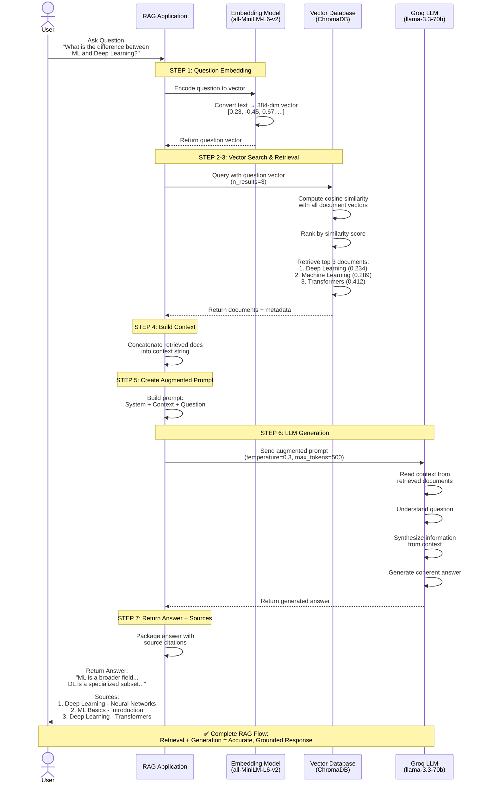

# RAG (Retrieval-Augmented Generation) - Use Case Flow

## Overview

This document explains how RAG works in Week 4's exercise, showing the complete flow from user question to AI-generated answer.

---

## 🎯 What is RAG?

**RAG (Retrieval-Augmented Generation)** combines two powerful techniques:
1. **Retrieval**: Finding relevant information from a knowledge base
2. **Generation**: Using an LLM to create accurate answers based on retrieved information

**Key Benefit**: Reduces AI hallucinations by grounding responses in actual data!

---

## 📊 Mermaid Sequence Diagram



## 📊 Complete RAG Flow Diagram (ASCII)

```
┌─────────────────────────────────────────────────────────────────┐
│                    USER ASKS A QUESTION                          │
│  "What is the difference between ML and Deep Learning?"          │
└────────────────────────┬────────────────────────────────────────┘
                         │
                         ▼
┌─────────────────────────────────────────────────────────────────┐
│              STEP 1: QUESTION EMBEDDING                          │
│  ┌──────────────────────────────────────────────────────────┐  │
│  │ Embedding Model (all-MiniLM-L6-v2)                       │  │
│  │ Converts question → 384-dimensional vector               │  │
│  │                                                           │  │
│  │ "What is the difference..." → [0.23, -0.45, 0.67, ...]  │  │
│  └──────────────────────────────────────────────────────────┘  │
└────────────────────────┬────────────────────────────────────────┘
                         │
                         ▼
┌─────────────────────────────────────────────────────────────────┐
│         STEP 2: VECTOR SIMILARITY SEARCH                         │
│  ┌──────────────────────────────────────────────────────────┐  │
│  │ ChromaDB Vector Database                                 │  │
│  │                                                           │  │
│  │ Knowledge Base (10 documents):                           │  │
│  │ • doc1: "Machine Learning is..."      [0.21, -0.43, ...] │  │
│  │ • doc2: "Deep Learning is..."         [0.25, -0.41, ...] │  │
│  │ • doc3: "NLP is..."                   [0.15, -0.52, ...] │  │
│  │ • doc4: "Transformers are..."         [0.18, -0.48, ...] │  │
│  │ • ... (6 more documents)                                 │  │
│  │                                                           │  │
│  │ Compares question vector with all document vectors       │  │
│  │ using cosine similarity                                  │  │
│  └──────────────────────────────────────────────────────────┘  │
└────────────────────────┬────────────────────────────────────────┘
                         │
                         ▼
┌─────────────────────────────────────────────────────────────────┐
│         STEP 3: RETRIEVE TOP-K DOCUMENTS                         │
│  ┌──────────────────────────────────────────────────────────┐  │
│  │ Top 3 Most Relevant Documents (by similarity):           │  │
│  │                                                           │  │
│  │ 1. doc2 (Distance: 0.234) - "Deep Learning is..."       │  │
│  │    Category: Deep Learning | Topic: Neural Networks      │  │
│  │                                                           │  │
│  │ 2. doc1 (Distance: 0.289) - "Machine Learning is..."    │  │
│  │    Category: ML Basics | Topic: Introduction             │  │
│  │                                                           │  │
│  │ 3. doc4 (Distance: 0.412) - "Transformers are..."       │  │
│  │    Category: Deep Learning | Topic: Transformers         │  │
│  └──────────────────────────────────────────────────────────┘  │
└────────────────────────┬────────────────────────────────────────┘
                         │
                         ▼
┌─────────────────────────────────────────────────────────────────┐
│         STEP 4: BUILD CONTEXT FROM RETRIEVED DOCS                │
│  ┌──────────────────────────────────────────────────────────┐  │
│  │ Context = Concatenate retrieved documents:               │  │
│  │                                                           │  │
│  │ Document 1 (Deep Learning - Neural Networks):            │  │
│  │ Deep Learning is a subset of machine learning that       │  │
│  │ uses neural networks with multiple layers...             │  │
│  │                                                           │  │
│  │ Document 2 (ML Basics - Introduction):                   │  │
│  │ Machine Learning is a subset of artificial intelligence  │  │
│  │ that enables systems to learn and improve...             │  │
│  │                                                           │  │
│  │ Document 3 (Deep Learning - Transformers):               │  │
│  │ Transformers are a type of neural network architecture...│  │
│  └──────────────────────────────────────────────────────────┘  │
└────────────────────────┬────────────────────────────────────────┘
                         │
                         ▼
┌─────────────────────────────────────────────────────────────────┐
│         STEP 5: CREATE AUGMENTED PROMPT                          │
│  ┌──────────────────────────────────────────────────────────┐  │
│  │ System Prompt:                                           │  │
│  │ "You are a helpful AI assistant that answers questions   │  │
│  │  based on provided context."                             │  │
│  │                                                           │  │
│  │ User Prompt:                                             │  │
│  │ "Context:                                                │  │
│  │  [Retrieved documents inserted here]                     │  │
│  │                                                           │  │
│  │  Question: What is the difference between ML and DL?     │  │
│  │                                                           │  │
│  │  Answer:"                                                │  │
│  └──────────────────────────────────────────────────────────┘  │
└────────────────────────┬────────────────────────────────────────┘
                         │
                         ▼
┌─────────────────────────────────────────────────────────────────┐
│         STEP 6: LLM GENERATION (Groq)                            │
│  ┌──────────────────────────────────────────────────────────┐  │
│  │ Model: llama-3.3-70b-versatile                           │  │
│  │ Temperature: 0.3 (more focused, less creative)           │  │
│  │ Max Tokens: 500                                          │  │
│  │                                                           │  │
│  │ LLM reads context + question and generates answer        │  │
│  └──────────────────────────────────────────────────────────┘  │
└────────────────────────┬────────────────────────────────────────┘
                         │
                         ▼
┌─────────────────────────────────────────────────────────────────┐
│         STEP 7: RETURN ANSWER + SOURCES                          │
│  ┌──────────────────────────────────────────────────────────┐  │
│  │ Answer:                                                  │  │
│  │ "Machine Learning is a broader field that enables        │  │
│  │  systems to learn from data without explicit             │  │
│  │  programming. Deep Learning is a specialized subset      │  │
│  │  of ML that uses multi-layered neural networks to        │  │
│  │  learn hierarchical representations, making it           │  │
│  │  particularly effective for complex tasks like image     │  │
│  │  recognition and NLP."                                   │  │
│  │                                                           │  │
│  │ Sources:                                                 │  │
│  │ 1. Deep Learning - Neural Networks                       │  │
│  │ 2. ML Basics - Introduction                              │  │
│  │ 3. Deep Learning - Transformers                          │  │
│  └──────────────────────────────────────────────────────────┘  │
└─────────────────────────────────────────────────────────────────┘
```

---

## 🔍 Detailed Step-by-Step Breakdown

### Step 1: Question Embedding
```python
# User asks a question
question = "What is the difference between ML and Deep Learning?"

# Convert to vector using SentenceTransformer
embedding_model = SentenceTransformer('all-MiniLM-L6-v2')
question_vector = embedding_model.encode(question)
# Result: [0.234, -0.456, 0.678, ...] (384 dimensions)
```

**Why?** Computers can't understand text directly. Embeddings convert text into numbers that capture semantic meaning.

---

### Step 2: Vector Similarity Search
```python
# ChromaDB searches for similar vectors
results = collection.query(
    query_texts=[question],
    n_results=3  # Get top 3 most similar documents
)
```

**How it works:**
- Compares question vector with all document vectors
- Uses cosine similarity: `similarity = cos(θ) = (A·B) / (||A|| ||B||)`
- Returns documents with highest similarity scores

**Example Similarity Scores:**
- doc2 (Deep Learning): 0.89 ✅ (very similar)
- doc1 (Machine Learning): 0.85 ✅ (very similar)
- doc4 (Transformers): 0.72 ✅ (somewhat similar)
- doc3 (NLP): 0.45 ❌ (less similar)

---

### Step 3: Retrieve Top Documents
```python
# Extract the most relevant documents
retrieved_docs = results['documents'][0]  # Top 3 documents
retrieved_metadata = results['metadatas'][0]  # Their metadata

# Example output:
# doc2: "Deep Learning is a subset of machine learning..."
# doc1: "Machine Learning is a subset of AI..."
# doc4: "Transformers are a type of neural network..."
```

---

### Step 4: Build Context
```python
# Combine retrieved documents into context
context = "\n\n".join([
    f"Document {i+1} ({meta['category']} - {meta['topic']}):\n{doc}"
    for i, (doc, meta) in enumerate(zip(retrieved_docs, retrieved_metadata))
])
```

**Result:**
```
Document 1 (Deep Learning - Neural Networks):
Deep Learning is a subset of machine learning that uses neural networks...

Document 2 (ML Basics - Introduction):
Machine Learning is a subset of artificial intelligence...

Document 3 (Deep Learning - Transformers):
Transformers are a type of neural network architecture...
```

---

### Step 5: Create Augmented Prompt
```python
prompt = f"""You are a helpful AI assistant. Answer based on context.

Context:
{context}

Question: {question}

Answer:"""
```

**Key Point:** The LLM now has relevant information to answer accurately!

---

### Step 6: LLM Generation
```python
# Send to Groq LLM
response = client.chat.completions.create(
    model="llama-3.3-70b-versatile",
    messages=[
        {"role": "system", "content": "You are a helpful AI assistant..."},
        {"role": "user", "content": prompt}
    ],
    temperature=0.3,  # Lower = more focused
    max_tokens=500
)

answer = response.choices[0].message.content
```

**LLM Process:**
1. Reads the context (retrieved documents)
2. Understands the question
3. Synthesizes information from context
4. Generates a coherent, accurate answer

---

### Step 7: Return Answer with Sources
```python
return {
    "answer": answer,
    "sources": [
        {"text": doc, "metadata": meta}
        for doc, meta in zip(retrieved_docs, retrieved_metadata)
    ]
}
```

**Benefits:**
- ✅ Answer is grounded in actual data
- ✅ Sources are traceable
- ✅ Reduces hallucinations
- ✅ Increases trust

---

## 🎓 Real-World Example from Exercise

### Question: "How can I reduce hallucinations in language models?"

**Step 1: Embedding**
```
Question → [0.12, -0.34, 0.56, ...] (384-dim vector)
```

**Step 2-3: Retrieval**
```
Top 3 Retrieved Documents:
1. doc6 (Distance: 0.198) - "RAG combines retrieval with generation..."
2. doc8 (Distance: 0.423) - "Fine-tuning is the process..."
3. doc9 (Distance: 0.467) - "Prompt Engineering is the practice..."
```

**Step 4-5: Context + Prompt**
```
Context: [3 documents about RAG, fine-tuning, and prompting]
Question: How can I reduce hallucinations?
```

**Step 6: LLM Generation**
```
Answer: "To reduce hallucinations in language models, you can use 
RAG (Retrieval-Augmented Generation), which grounds responses in 
retrieved documents from a knowledge base. Additionally, fine-tuning 
on domain-specific data and careful prompt engineering can help..."
```

**Step 7: Sources**
```
Sources Used:
1. Advanced AI - RAG
2. ML Basics - Model Training
3. LLM Usage - Prompting
```

---

## 💡 Key Advantages of RAG

### 1. **Accuracy**
- Answers based on actual data, not just model knowledge
- Reduces hallucinations significantly

### 2. **Traceability**
- Can cite sources for every answer
- Builds trust with users

### 3. **Up-to-date Information**
- Knowledge base can be updated without retraining model
- Add new documents anytime

### 4. **Domain Expertise**
- Works with specialized knowledge bases
- No need to fine-tune expensive models

### 5. **Cost-Effective**
- Use smaller, cheaper LLMs with good retrieval
- Don't need massive models for every task

---

## 🔧 Technical Components

### Embedding Model
- **Model**: `all-MiniLM-L6-v2`
- **Dimensions**: 384
- **Purpose**: Convert text to semantic vectors
- **Speed**: Fast, suitable for real-time

### Vector Database
- **Database**: ChromaDB
- **Storage**: In-memory (for demo)
- **Search**: Cosine similarity
- **Scalability**: Can handle millions of vectors

### LLM
- **Provider**: Groq
- **Model**: `llama-3.3-70b-versatile`
- **Speed**: Very fast inference
- **Quality**: High-quality responses

---

## 📈 Performance Metrics

### Retrieval Quality
- **Precision**: How many retrieved docs are relevant?
- **Recall**: Did we retrieve all relevant docs?
- **MRR (Mean Reciprocal Rank)**: Position of first relevant doc

### Generation Quality
- **Faithfulness**: Does answer match retrieved context?
- **Relevance**: Does answer address the question?
- **Coherence**: Is answer well-structured?

---

## 🚀 Advanced RAG Patterns (Future Topics)

### 1. **Hybrid Search**
- Combine vector search + keyword search
- Better for specific terms and concepts

### 2. **Re-ranking**
- Use a second model to re-rank retrieved documents
- Improves relevance of top results

### 3. **Query Expansion**
- Generate multiple variations of user query
- Retrieve more diverse documents

### 4. **Hierarchical RAG**
- First retrieve sections, then paragraphs
- Better for long documents

### 5. **Agentic RAG**
- AI agent decides when to retrieve
- Can retrieve multiple times
- More sophisticated reasoning

---

## 📝 Summary

**RAG Flow in 7 Steps:**
1. 🔤 Embed user question
2. 🔍 Search vector database
3. 📄 Retrieve top-K documents
4. 📚 Build context from documents
5. ✍️ Create augmented prompt
6. 🤖 Generate answer with LLM
7. ✅ Return answer + sources

**Key Takeaway:** RAG = Retrieval (finding relevant info) + Generation (creating answer) = Accurate, grounded AI responses!

---

## 🎯 Try It Yourself!

Run the Week 4 RAG exercise notebook and:
1. Add your own documents to the knowledge base
2. Try different questions
3. Experiment with different embedding models
4. Adjust the number of retrieved documents (n_results)
5. Try different LLM models and temperatures

**Happy RAG-ing!** 🚀
